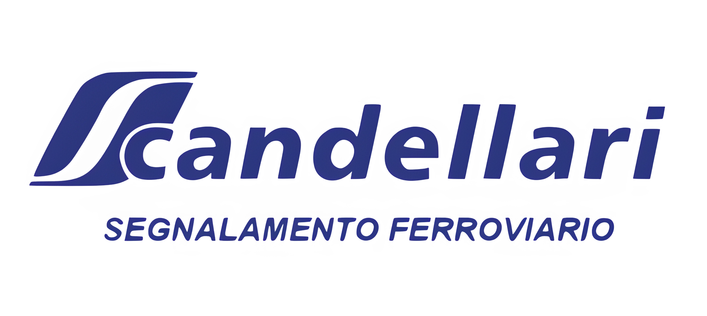

# 🏗️ Scandellari

> ⚠️ **PORTFOLIO SHOWCASE - PROPRIETARY CODE**  
> Questo repository è reso pubblico esclusivamente a scopo dimostrativo e di portfolio professionale.
> Il codice è di proprietà di **Scandellari** e non è Open Source. L'uso, la copia o la distribuzione non autorizzata sono vietati.

> **Piattaforma digitale aziendale per la gestione di progetti e certificazioni.**  
> Una Single Page Application moderna sviluppata per presentare l'eccellenza aziendale e gestire i contenuti tramite un'area amministrativa sicura.

---

## ✨ Funzionalità / Highlights

- 🏢 **Vetrina Aziendale**: Sezione pubblica completa con progetti, competenze, certificazioni e carriere.
- 🔐 **Area Admin Protetta**: Dashboard sicura per la gestione CRUD di progetti, competenze e offerte di lavoro.
- ⚡ **Performance Elevate**: Costruito su **Vite** e **React 19** per un caricamento istantaneo e navigazione fluida.
- 📄 **Gestione Documentale**: Viewer PDF integrato con worker dedicato per la consultazione di certificazioni (ISO 9001, etc.).
- 🗺️ **Mappe Interattive**: Integrazione **MapLibre** per la geolocalizzazione dei cantieri e progetti.
- 🎨 **UI/UX Moderna**: Design responsive con **Tailwind CSS**, tema chiaro/scuro e animazioni **GSAP/Lenis**.

## 🧠 Approfondimenti Tecnici

### 🔄 Architettura & Backend (Supabase)
Il progetto adotta un pattern di **Service Layer** per separare la logica di business dalla UI.
- **Data Layer**: Tutte le interazioni con Supabase passano attraverso `src/supabase/services.ts`. Questo garantisce un unico punto di accesso per le operazioni CRUD (Create, Read, Update, Delete) su Progetti, Competenze e Offerte di Lavoro.
- **Activity Logging**: Ogni operazione di modifica viene tracciata tramite `activityService`, permettendo agli amministratori di monitorare le modifiche ai contenuti in tempo reale.
- **Type Safety**: L'integrazione è fortemente tipizzata grazie a TypeScript, con interfacce dedicate (`ProgettoData`, `OffertaLavoroData`) che specchiano lo schema del database.

### 🎨 UX & Motion System (Lenis + GSAP)
L'esperienza utente è arricchita da un sistema di animazioni fluido e performante:
- **Smooth Scrolling**: Implementato con **Lenis**, che intercetta lo scroll nativo normalizzandolo per un'esperienza "burrosa" (buttery smooth) su tutti i device, mantenendo però l'accessibilità nativa.
- **Scroll Animations**: Utilizzo di **GSAP ScrollTrigger** per animare gli elementi all'entrata nel viewport. Il sistema è centralizzato in un `AnimationController` che osserva attributi data (`data-animate="fade-up"`, `data-animate-stagger`) per applicare automaticamente le transizioni senza dover scrivere logica JS per ogni componente.

### 🔐 Sicurezza & Admin
- **Protected Routes**: L'area amministrativa (`/admin`) è protetta da un wrapper `ProtectedRoute` che verifica la sessione utente in tempo reale tramite il `AuthContext`.
- **Row Level Security (RLS)**: Anche se il frontend filtra le azioni, la sicurezza vera è garantita a livello di database Supabase tramite policy RLS che impediscono scritture non autorizzate.

### 📄 Gestione PDF Ottimizzata
Per la visualizzazione delle certificazioni ISO/SOA, utilizziamo **React-PDF** con un worker dedicato (`pdf.worker.min.js`) servito staticamente dalla cartella `public`. Questo sposta il pesante lavoro di parsing del PDF su un thread separato, evitando di bloccare il main thread dell'interfaccia utente.

## 🛠️ Tech Stack

| Categoria | Tecnologia | Versione |
|-----------|------------|----------|
| **Frontend** | React (Vite) | v19.2 |
| **Linguaggio** | TypeScript | v5.9 |
| **Styling** | Tailwind CSS | v3.3 |
| **Routing** | React Router | v7.12 |
| **Database/Auth** | Supabase | Latest |
| **Animazioni** | GSAP & Lenis | - |
| **Mappe** | MapLibre GL | v4.7 |
| **PDF** | React PDF | v10.3 |

## 📸 Screenshots

*Logo.*

## 🔒 Proprietà Intellettuale e Uso Consentito

Questo repository è stato reso **pubblico esclusivamente a scopo di portfolio professionale**, per dimostrare le competenze tecniche nello sviluppo Full-Stack.

Il codice sorgente, il design, i loghi e i contenuti sono di proprietà esclusiva di **Scandellari** e sono protetti dalle leggi sul copyright.
**NON** viene concessa alcuna licenza d'uso (né open source, né commerciale).

### ⛔ Divieti
È severamente vietato:
- Copiare, clonare o scaricare il codice per scopi diversi dalla semplice consultazione.
- Utilizzare parti di questo progetto (codice o design) in altri lavori.
- Distribuire o rivendere il software.

Per i recruiter e le aziende interessate: il codice è consultabile per valutare la qualità tecnica, l'architettura e lo stile di programmazione.

## 📄 Licenza

Copyright © 2026 Scandellari. Tutti i diritti riservati.
L'uso non autorizzato di questo software o di parte del suo codice costituisce una violazione dei diritti di proprietà intellettuale.

## 📞 Contatti

**Marco** - Sviluppatore Full-Stack

[LinkedIn](https://www.linkedin.com/in/marconiccolini-/) • [GitHub](https://github.com/nicco6598)
